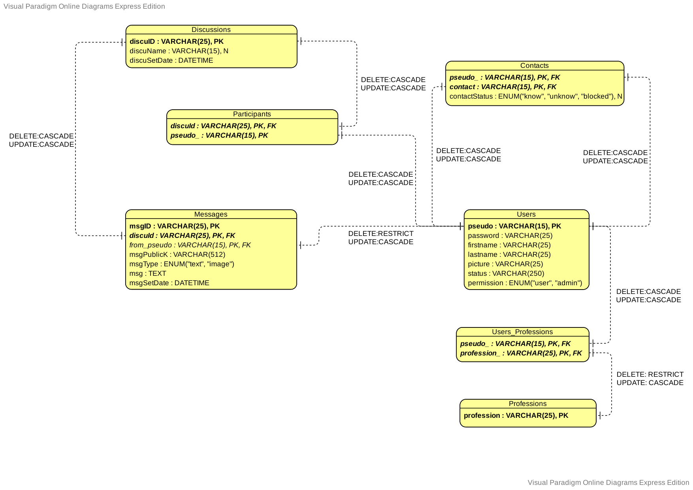
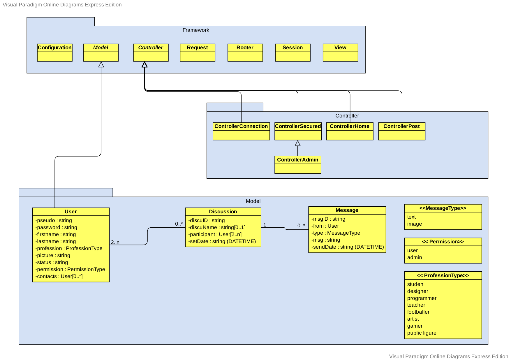
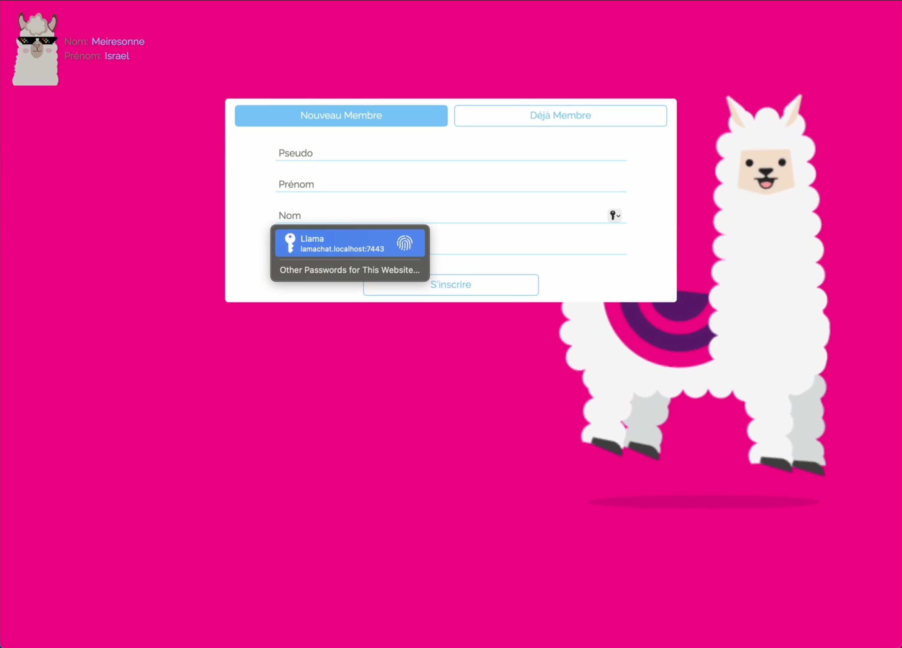
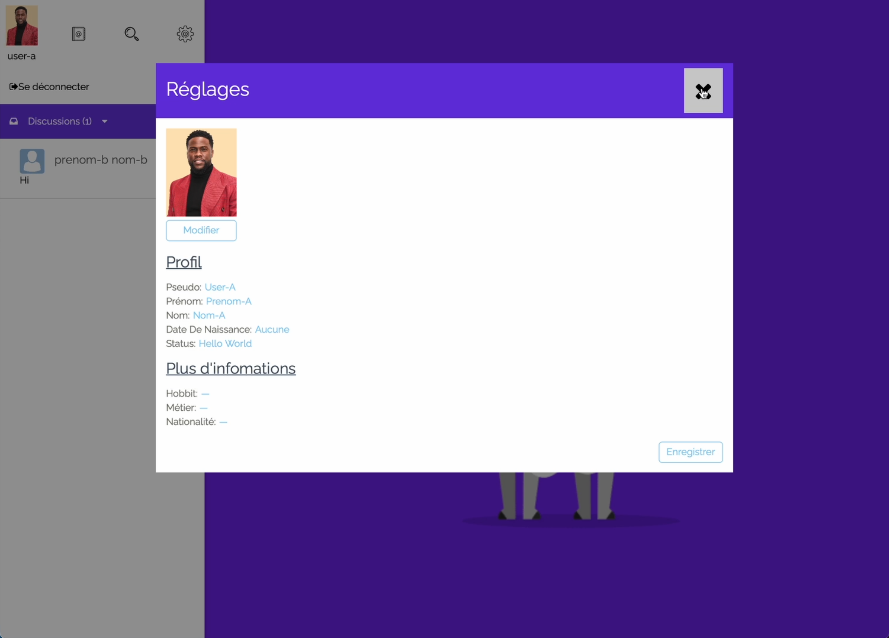
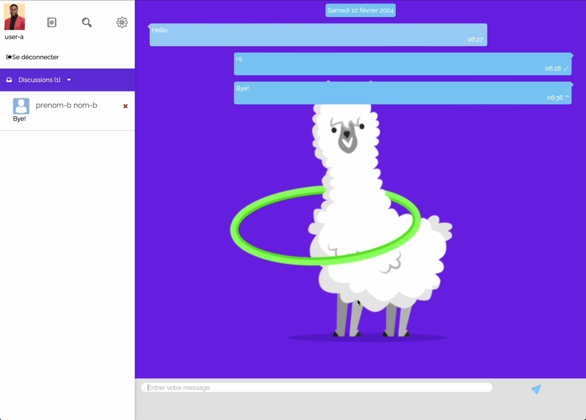
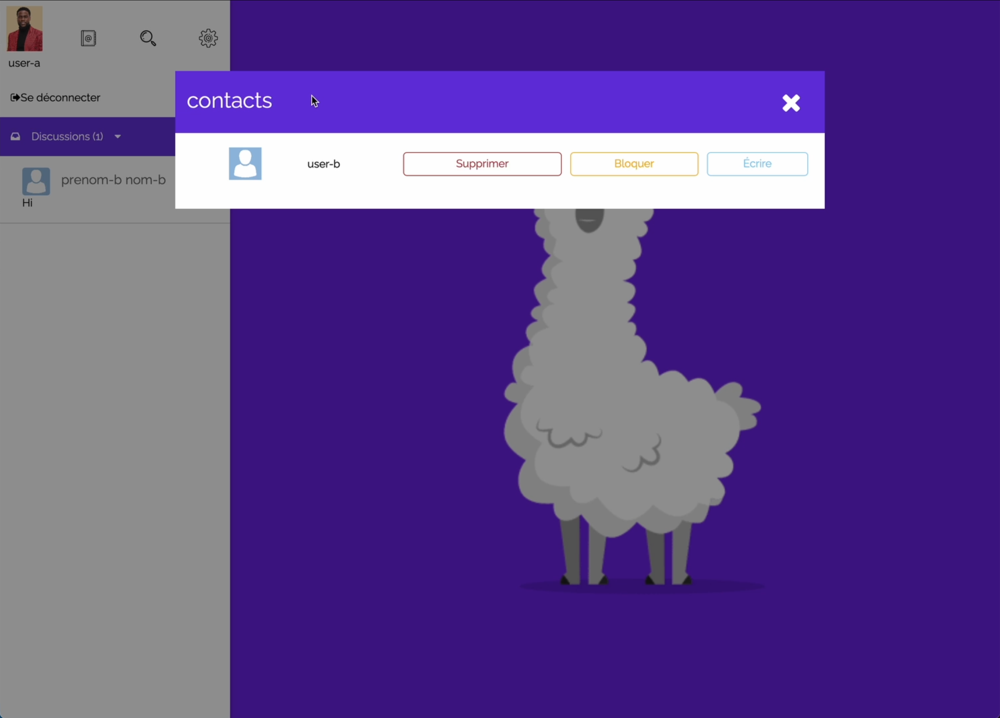
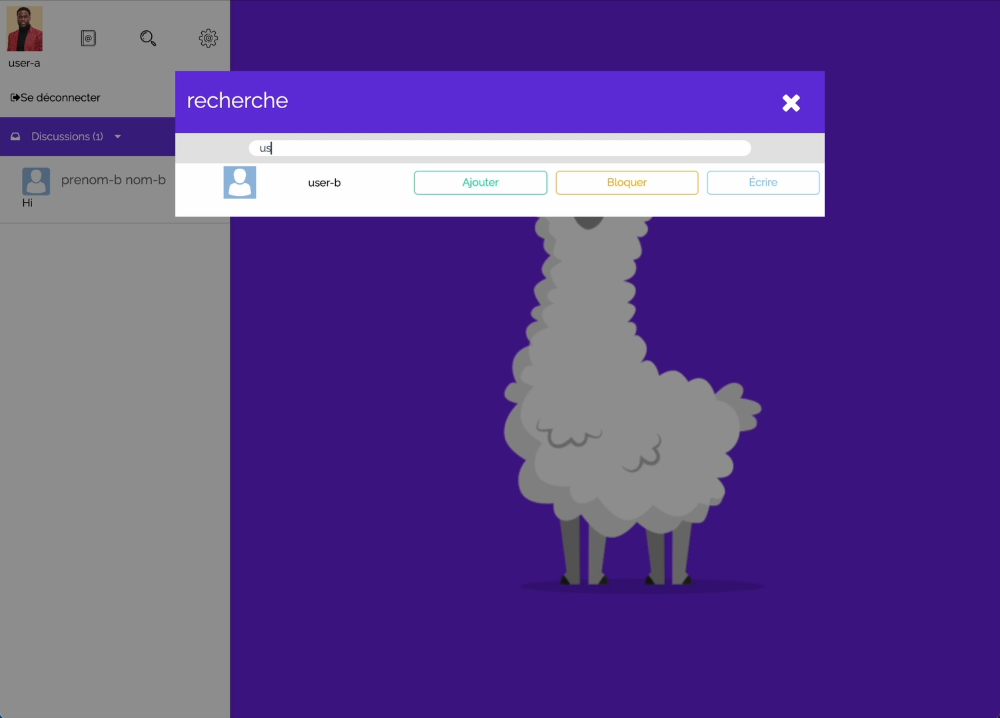
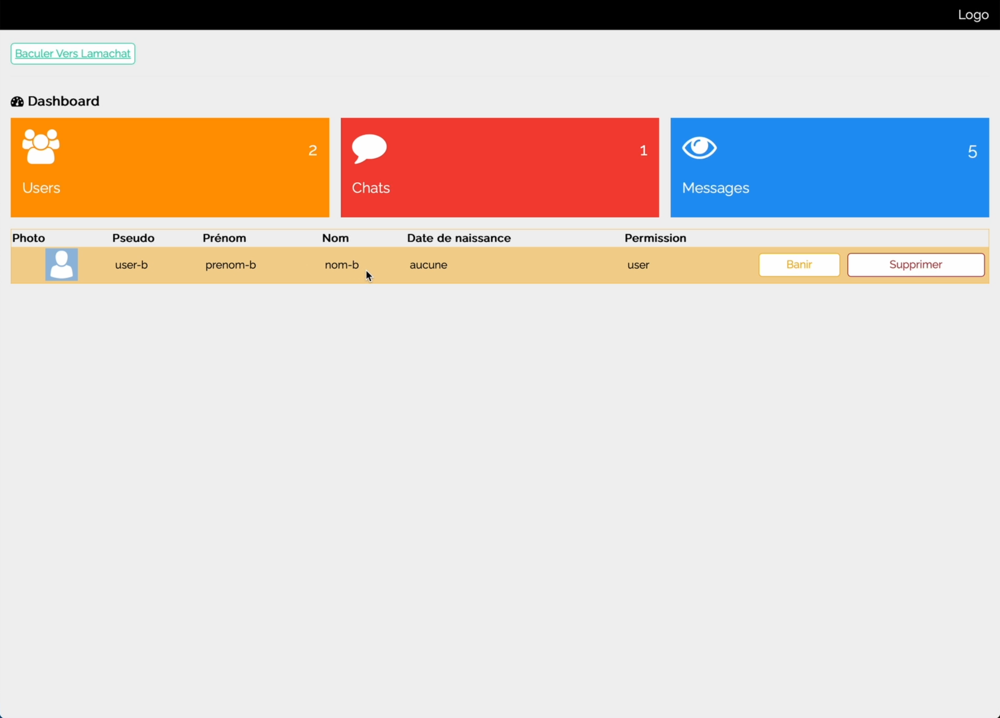
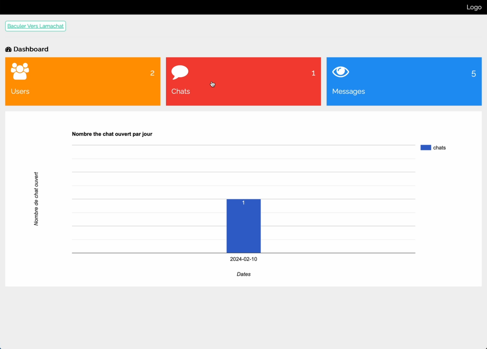

# Chat Application
<!-- ❌ Don't Delete This Comment ❌
Project short description:
  Full-stack real-time web chat application that enables instantaneous connections and communication between users.
Project Topics (tags):
  javascript  mysql  css  html  jquery php
-->

A real-time web chat application that enables instantaneous connections and communication between users.
The application implements an administrator interface that allows administrators to track statistics and moderate users.

## Features

* Users Sign up and sign in
* Real-time communication between users
* Change profile information, like:
  * Profile picture
  * Name, surname, status, hobby, etc...
* Users search engine
* Users can add, remove and block their contacts
* Support for multiple chat rooms
* Support Emoji in messages
* Admin interface:
  * Consult messaging statistics
  * Moderate users (banish and delete)
* Layout statistic plot through the **Google Chart API**
* Responsive design

See all features in action on Youtube (with *TimeCodes*): <https://www.youtube.com/watch?v=d3G8BUmJmN0>

## Technologies

* Back-end:
  * PHP 7.4
  * MySQL
* Front-end:
  * HTML
  * CSS
  * JavaScript
  * JQuery

## Documentation

### ER-Diagram

### Class Diagram

## Screenshots

### Landing page

### Profile

### Chat

### Contact

### Search

### Administrator: Users

### Administrator: Statistics

